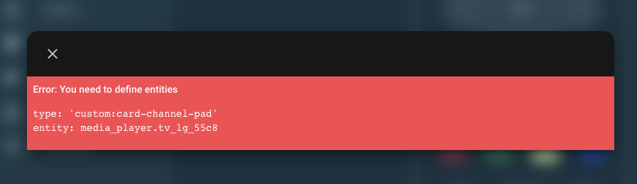
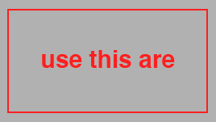
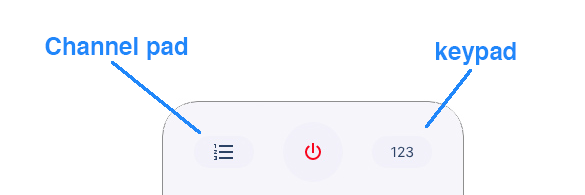

# BREAKING CHANGE
please read the new configuration carefully

new options available

the project is now curated and developed in collaboration with [Piotr Machowski](https://github.com/PiotrMachowski)

# LG-WebOS-Remote-Control
Remote Control for LG TV WebOS


browser_mod is required for this channel panel
custom card: "card-channel-pad" is required.(you can find it on my github)


browser_mod is required for this keypad
custom card: "card-numeric-pad" is required.(you can find it on my github)

**NOTE: need in "your-theme.yaml**
```yaml
#button
  deactive-background-button-color: "#f2f0fa"
```


#f2f0fa" referred to the clear remote control
"#333336" referred to the dark remote control
obviously you can customize the color to harmonize the remote control with your theme

**lovelace config: default view**
```yaml
- type: 'custom:lg-remote-control'
  entity: media_player.tv_lg_55c8
```
**Channel pad**
in this version of the card there is no longer a "channel pad popup" with preset channels.
this is to give each user the ability to create his own list.

"source:" configuration is not mandatory. if "source:" is not configured the remote control will work normally but you will not be able to use the channel pad.
pressing the button on the remote control you will receive this message.


**new features congif**
in this new version we have implemented some new features:
  - customizable and incremental app buttons
    
    option: **source:** ( if you do not configure this option, the remote control will display the default apps)
  - customizable channel list
    
    option: **channels:** ( if you do not configure this option, the remote control will display the default channels list)
  - customizable scale:
    
    option: **scale:** ( this option reduces or enlarges the size of the remote control. we are testing this option )

**lovelace config: custom view**
```yaml
- type: 'custom:lg-remote-control'
  entity: media_player.tv_lg_55c8
  sources:
    - name: Netflilx
      icon: 'mdi:netflilx'
    - name: Disney
      icon: disney
    - name: Dazn
      icon: dazn
    - name: YouTube
      icon: 'mdi:youtube-tv'
    - name: HDMI 1
      icon: 'mdi:video-input-hdmi'
    - name: HDMI 2
      icon: 'mdi:video-input-hdmi'
  channels:
    - image: /local/images/tv_logo/channel_1.png
      number: '1'
    - image: /local/images/tv_logo/channel_2.png
      number: '1'
  scale: 0,5
   
```
**note: disney and danz are special icon. so you you must enter it as in the example**

## hacs Card install
1. add custom reposity: madmicio/LG-WebOS-Remote-Control as plugin.

2. install `LG WebOS Remote Control` plugin

3. Add a reference  inside your resources config:

  ```yaml
resources:
  - type: module
    url: /hacsfiles/LG-WebOS-Remote-Control/lg-remote-control.js
```


### Manual install

1. Download and copy `lg-remote-control.js` from (https://github.com/madmicio/LG-WebOS-Remote-Control) into your custom components  directory.

2. Add a reference `lg-remote-control.js` inside your resources config:

  ```yaml
  resources:
    - url: /local/"your_directory"/lg-remote-control.js
      type: module
  ```
  
  ## Install Tv Logo
  
  1. download tv_logo
  2. direcoty put the images file where you prefer (we suggest: www / images / tv_logo)
  3. calls the image in the configuration as in the example 
```yaml
image: /local/your_directory/your_file.png
```
**new_tv logo**
at this moment only tv logo of italian tv are available.
users who produce other logos are invited to share them, so we could have a complete and international library
**new logo spec**
height: 268px
width: 171px
background: transparent
image must have 10px margin like this example:




## Popup Buttons



**NOTE**
- **SMART** button not enable
- **INPUT** button not enable
