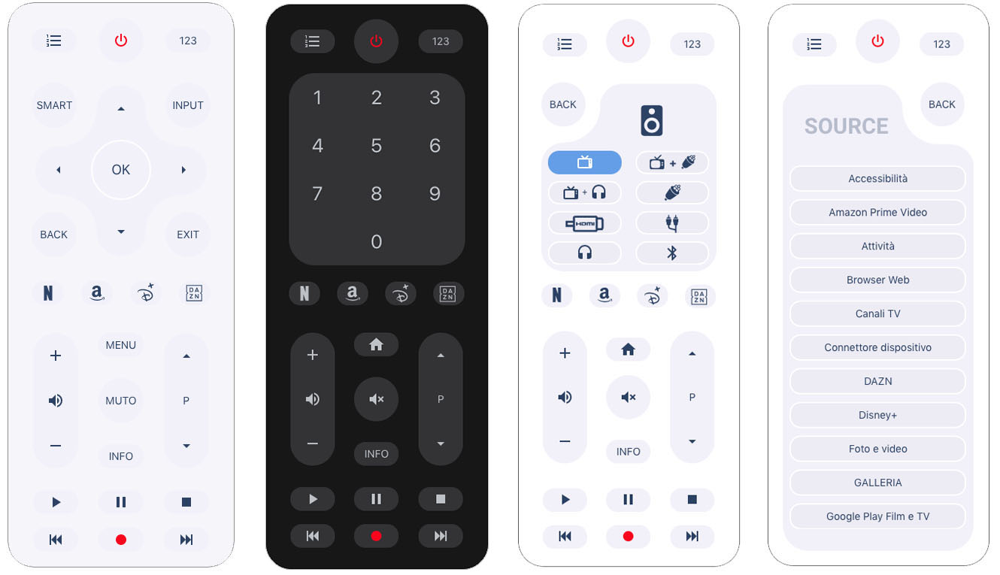

# LG-WebOS-Remote-Control
Remote Control for LG TV WebOS

[](https://github.com/custom-components/hacs)
[](https://www.buymeacoffee.com/madmicio)

the project is now curated and developed in collaboration with [Piotr Machowski](https://github.com/PiotrMachowski)





browser_mod is required for this channel panel (you can find it [here](https://github.com/thomasloven/hass-browser_mod))

custom card: "card-channel-pad" is required (you can find it [here](https://github.com/madmicio/channel-pad))

## New Features:

added two panels:
- Integrated keypad
- TV App List
- Sound Output Panel
- Color buttons (option)


## Color Management
color customization implemented through the section
```yaml
colors:
```


- buttons: set buttons  background color    - default: "#f2f0fa"
- texts: set buttons color                  - default: "var(--primary-text-color)"
- background: set remote background color   - default: "var(--primary-background-color)"
```yaml
colors:
  buttons: var(--deactive-background-button-color)
  texts: pink
  background: rgba(95,155,234)
```

**NOTE: option in "your-theme.yaml**
```yaml
#button
  deactive-background-button-color: "#f2f0fa"
```

## hacs Card install
1. add custom repository: madmicio/LG-WebOS-Remote-Control as plugin.

2. install `LG WebOS Remote Control` plugin

3. Add a reference  inside your resources config:

  ```yaml
resources:
  - type: module
    url: /hacsfiles/LG-WebOS-Remote-Control/lg-remote-control.js
```


### Manual install

1. Download and copy `lg-remote-control.js` from (https://github.com/madmicio/LG-WebOS-Remote-Control) into your custom components  directory.

2. Add a reference `lg-remote-control.js` inside your resources config:

  ```yaml
  resources:
    - url: /local/"your_directory"/lg-remote-control.js
      type: module
  ```
# lovelace config: default view
```yaml
- type: 'custom:lg-remote-control'
  entity: media_player.tv_lg_55c8
```

### Main Options
| Name | Type | Default | Supported options | Description |
| -------------- | ----------- | ------------ | ------------------------------------------------ | --------------------------------------------------------------------------------------------------------------------------------------------------------------------------------------------------------------------------------------------------------------------------------------------------------------------------------------------- |
| `type` | string | **Required** | `custom:lg-remote-control` | Type of the card |
| `entity` | string | **Required** |  | tv entity |
| `colors` | string | **Option** |  | list of color options |
| `channels` |  | **Option**|  | list of channel in popup |
| `sources` |  | **Option**|  | list of custom app. if not set, default apps will be displayed |
| `color_buttons` |  | **Option**| enable | display color buttons: RED GREEN YELLOW BLUE |

### Source Options
| Name | Type | Default | Supported options | Description |
| -------------- | ----------- | ------------ | ------------------------------------------------ | --------------------------------------------------------------------------------------------------------------------------------------------------------------------------------------------------------------------------------------------------------------------------------------------------------------------------------------------- |
| `icon` | string | **Required** | 'mdi:netflix'| url of the image to be displayed in the channel pad popup |
| `name` | string | **Required** | app name | you have to write the exact name of the app to launch. you can find the correct name in the state of your media_player entity under "source_list:" |
```yaml
sources:
  - icon: 'mdi:power'
    name: "Netflix"
  - icon: 'mdi:amazon'
    name: "Amazon Prime Video"
  - icon: 'mdi:youtube'
    name: "YouTube"
```
**Note:**  `disney` and `dazn` are special, icon you must enter them like this:
```yaml
  - icon: disney
    name: Disney
  - icon: dazn
    name: Dazn
```
### Channels Options
| Name | Type | Default | Supported options | Description |
| -------------- | ----------- | ------------ | ------------------------------------------------ | --------------------------------------------------------------------------------------------------------------------------------------------------------------------------------------------------------------------------------------------------------------------------------------------------------------------------------------------- |
| `image` | url | **Required** | /local/your_dir/tv_logo/your_image.png | url of the image to be displayed in the channel pad popup |
| `number` | string | **Required** | number | TV channel number |
```yaml
channels:
  - image: /local/lg_remote/tv_logo/Rai 1 HD.png
    number: '501'
  - image: /local/lg_remote/tv_logo/Rai 2 HD.png
    number: '502'
  - image: /local/lg_remote/tv_logo/Rai 3 HD.png
    number: '503'
```

### Colors Options
| Name | Type | Default | Supported options | Description |
| -------------- | ----------- | ------------ | ------------------------------------------------ | --------------------------------------------------------------------------------------------------------------------------------------------------------------------------------------------------------------------------------------------------------------------------------------------------------------------------------------------- |
| `buttons` | string | **Option** | color formats | buttons background-color |
| `texts` | string | **Option** | color formats | number and icon color |
| `background:` | string | **Option** | color formats | list of color options |
# Channel pad
in this version of the card there is no longer a "channel pad popup" with preset channels.
this is to give each user the ability to create his own list.

"channels" configuration is not mandatory. if "channels" is not configured the remote control will work normally but you will not be able to use the channel pad.
pressing the button on the remote control you will receive this message.


# New Features Config
in this new version we have implemented some new features:
1. customizable and incremental app button

    option: **sources:** ( if you do not configure this option, the remote control will display the default apps)

2. customizable channel pad

    option: **channels:** ( if you do not configure this option, on button click you receive an error message)

3. customizable scale:

    option: **scale:** ( this option reduces or enlarges the size of the remote control. we are testing this option )

# lovelace config: custom view
```yaml
- type: 'custom:lg-remote-control'
  entity: media_player.tv_lg_55c8
  sources:
    - name: Netflix
      icon: 'mdi:netflix'
    - name: Disney
      icon: disney
    - name: Dazn
      icon: dazn
    - name: YouTube
      icon: 'mdi:youtube-tv'
    - name: HDMI 1
      icon: 'mdi:video-input-hdmi'
    - name: HDMI 2
      icon: 'mdi:video-input-hdmi'
  channels:
    - image: /local/images/tv_logo/channel_1.png
      number: '1'
    - image: /local/images/tv_logo/channel_2.png
      number: '1'
  scale: 1
   
```
**note: disney and danz are special icon. so you you must enter it as in the example**


  
  ## Install Tv Logo
  
  1. download tv_logo
  2. directory put the images file where you prefer (we suggest: www / images / tv_logo)
  3. calls the image in the configuration as in the example 
```yaml
image: /local/your_directory/your_file.png
```
**new_tv logo**
at this moment only tv logo of italian tv are available.
users who produce other logos are invited to share them, so we could have a complete and international library
**new logo spec**
height: 268px
width: 171px
background: transparent
image must have 10px margin like this example:


## Popup Buttons


<a href="https://www.buymeacoffee.com/madmicio" target="_blank"></a>

