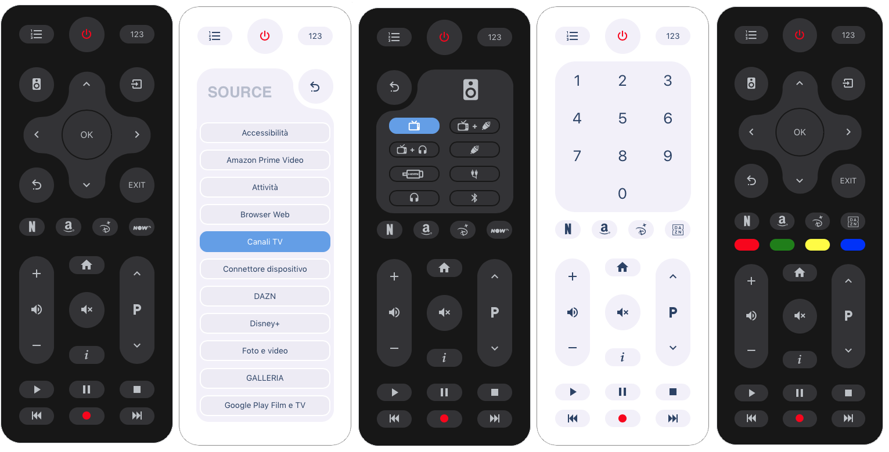
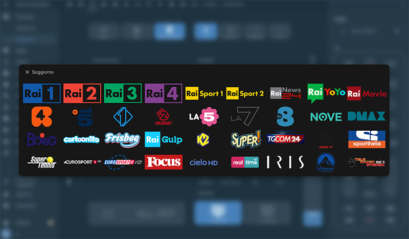
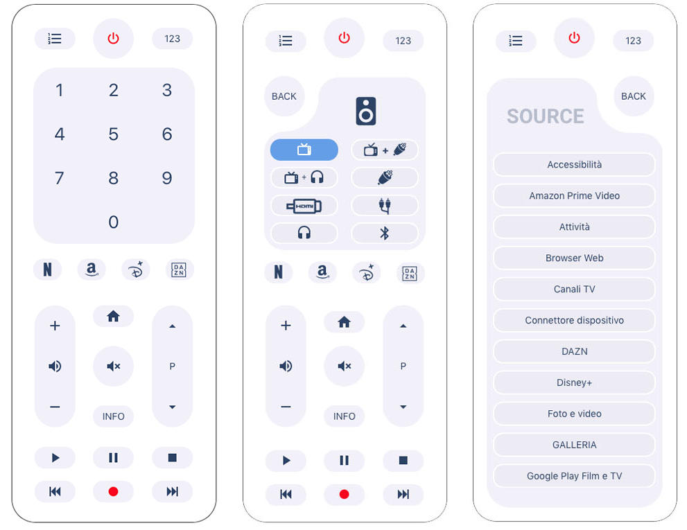
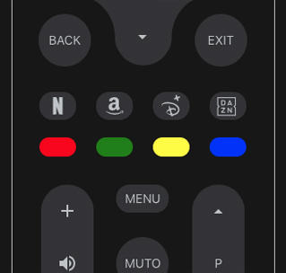

## Release Note: New Features added
see the details below

# LG-WebOS-Remote-Control
Remote Control for LG TV WebOS

browser_mod is required for this channel panel

custom card: "card-channel-pad" is required.(you can find it on my github)

## New Features:

added two panels:
- TV App List
- Sound Output Pannel
- Integrated keypad
- Color buttons (option)
- sccale option
- remote border color
- remote border width

